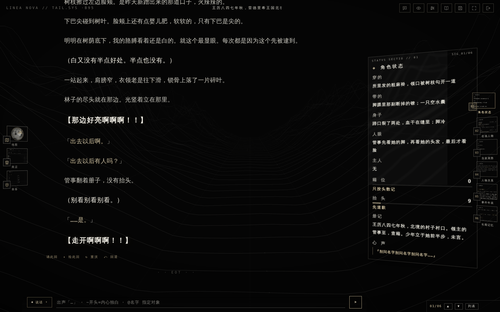
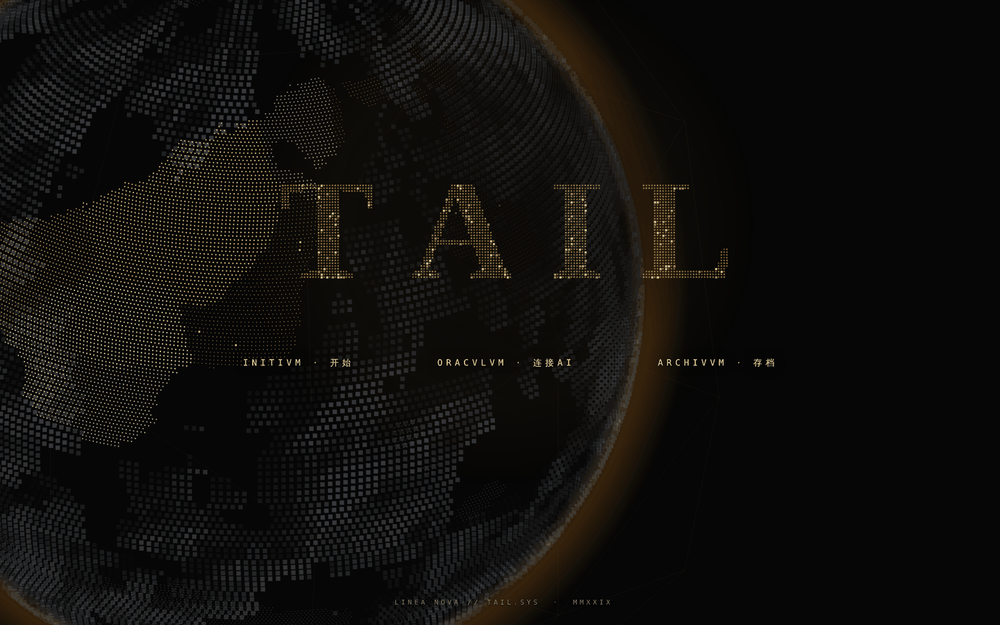
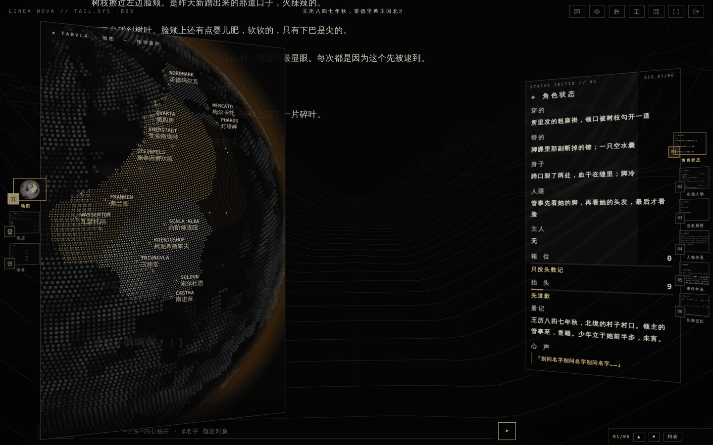
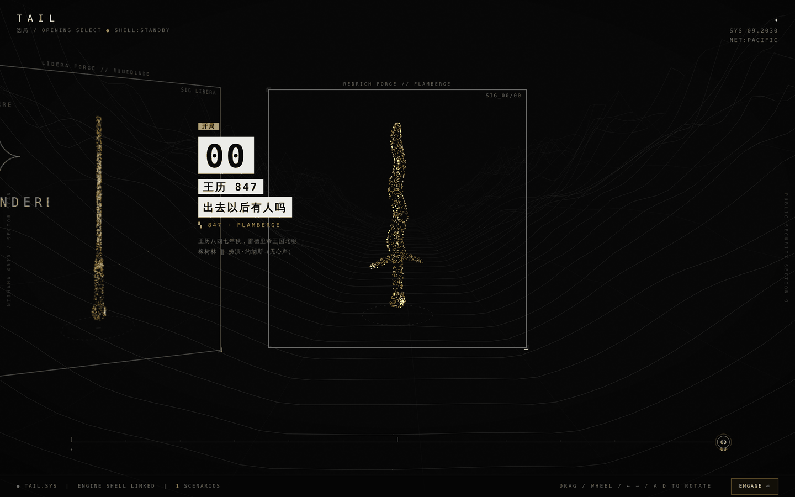
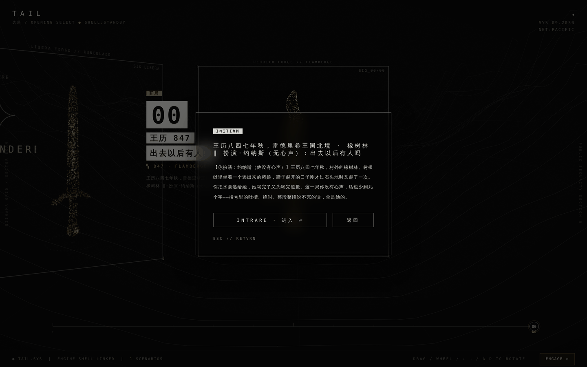
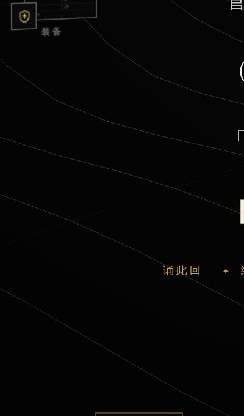
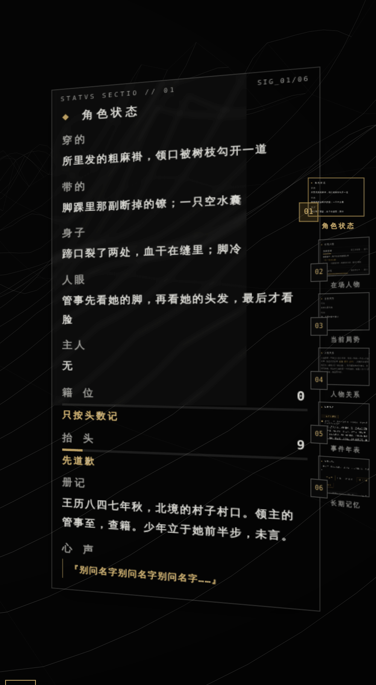
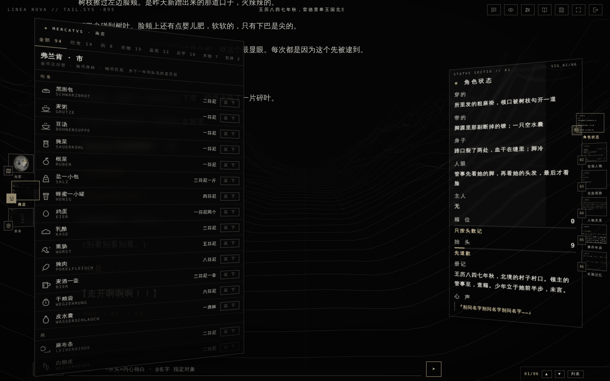
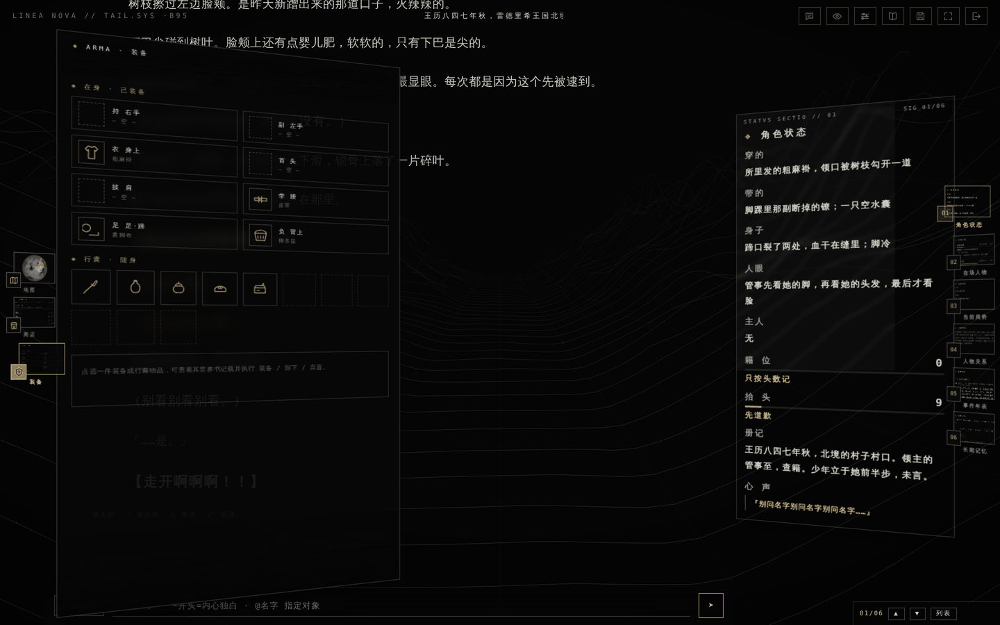
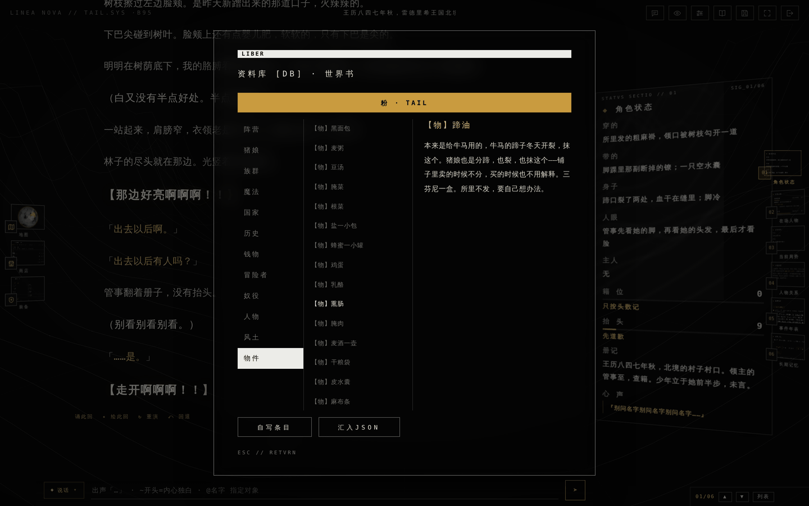

# 粉

**TAIL.SYS · 旁观版**

---

> 王历八四七年秋，雷德里希王国北境，橡树林。
>
> 你是约纳斯，佃农的次子，十八岁。今天你出村来捡橡子，在林子正中央的树根缝里看见一点粉色。
>
> 那是一头逃出来的猪娘。脚踝上的铁环还嵌在肉里，链子从断掉的地方起只剩短短一截，一动就挂住干叶子。她先开口跟你道歉。
>
> **你没有心声。**说个不停的是她。

## ✦ 这一版是什么

这是一张**旁观卡**。你操纵的那个人不写内心：不许写他想什么、觉得什么、明白了什么，关于他只写看得见的——做了什么、看了哪里、手抓住了什么、说了哪一句短话。他一幕里说话不超过五次，玩家没有打字让他说的话，他就不说。

全篇唯一有里子的是那只猪娘。地の文贴着她走，`（）` 里的小声吐槽、`【】` 里的爆发绝叫，一处都不许挂到你身上。她嘴上说的和心里想的必须对不上：嘴上「对不起」，括号里不肯认。

正文分三层，各有各的排法：地の文是底色，`（）` 比它亮一档，`【】` 再亮一档并且明显更大，`「」` 走金色。这三层是这张卡最要紧的东西，所以它们各自有自己的字号与颜色，而不是一路同色同号排下去。

## ✦ 起動 —— 卡尔提亚

打开的第一眼是这颗星球。不是地球换了地名——大陆的形状、海岸、岛链全部另生成一遍，六个政权、三十二处地名各安其位。

没有设计到的地方用**体积雾**盖住，而且**没有雾的区域只有一块**：那一块不规则、不贴着大陆的边缘，正好露出主大陆、一小段东边的大陆、和几座岛。海峡是白令式的——两块大陆之间一串踏石，不是一座桥。

| 政权 | 是什么 |
|---|---|
| **雷德里希王国** | 人类王室，都城艾伯斯塔特。农业国，出黑麦、亚麻、乳母。王家育婴与乳母署直属王室内库 |
| **弗兰肯自由都市同盟** | 十一座商业都市，没有王。冒险者公会总部在这里。奴隶买卖合法，按人头抽关税 |
| **阿尔卡狄圣教国** | 教权国。神学主张三蹄论：造物分蹄者为仆，不分蹄者为主 |
| **索尔杜恩骑士领** | 马娘军事贵族国。常备骑士九成是马娘家系，这两年缺步兵 |
| **梅尔卡托港市** | 猫娘为主的港口自治市。情报、娱乐、走私。这里对猪娘最松——不是善意，是人手不够 |
| **诺德玛尔克边境伯领** | 北境。迷宫、魔物、冒险者。领内不收人头税，收的是入洞钱 |

## ✦ 選局 —— 粒子的剑

点「INITIVM · 开始」，开局与自定义两张卡同框排开。卡上的粒子是一把剑：剑身、血槽、护手、缠绳的柄、嵌着石头的柄头，各自按参数生成，转起来是三维的。

自定义那张是**符文剑**（刃面刻满符文），开局零那张是**焰形剑**（刃口起伏）。剑身最后一段按卵形收成尖——这一段是真的收到零，不是收到一半平着截断。

| | 局 | 年 | 你扮演 |
|---|---|---|---|
| ✦ | 自定义开局 | 王历 847 | 自己拣一处落脚，自己写一个人 |
| 00 | 出去以后有人吗 | 王历 847 秋 | 约纳斯（佃农次子，十八岁，**无心声**） |

选中之后先给一段导览：时间、地点、你是谁、现在的局面。没读过设定也能三十秒上手。

## ✦ 台前调度 —— 三扇缩略窗

左栏是一列**斜着的小窗**，每一枚是那个抽屉的真实缩略图。点一下，对应的抽屉滑出来；正在开着的那一枚转正、贴金边、往右挪一点。

| 窗 | 内容 |
|---|---|
| **地图** | TABVLA · 转动的卡尔提亚，雾外的那一块标着地名 |
| **商店** | MERCATVS · 弗兰肯的市 |
| **装备** | ARMA · 身上的与行囊里的 |

## ✦ 情報台 —— 逐栏说明

右栏六页翻册，每一页随剧情逐轮实时结算。

| 页 | 内容 |
|---|---|
| **01 角色状态** | 穿的 / 带的 / 身子 / 人眼 / 主人五栏，外加两条量表、一句心声、一行册记 |
| **02 在场人物** | 此刻同框者、各自的姿态，与「眼色」——这个人此刻怎么看她 |
| **03 当前局势** | 本幕的局面与压在头上的那条律 |
| **04 人物关系** | 出场人物结成的关系网，点选查看心向 |
| **05 事件年表** | 编年时间轴，剧情大事自动归档 |
| **06 长期记忆** | 每一轮的纪年、时地、我之举与册记自动摘成一条纪要，永久保存并每轮全文送呈 |

### 两条量表

不用血条和等级，用两条更贴题的——它们由剧情驱动，不可手动加点：

**籍位** —— 你在这个世界的册子上站得有多稳。

| 档 | 状态 |
|---|---|
| 0 | 只按头数记 |
| 25 | 有名字，没有姓 |
| 50 | 入了户，能立契 |
| 75 | 能作证，能告状 |
| 95 | 谁也动不得 |

**抬头** —— 那层「先道歉」的皮掉了多少。

| 档 | 状态 |
|---|---|
| 0 | 先道歉 |
| 25 | 话说完了才道歉 |
| 50 | 不道歉了 |
| 75 | 问回去 |
| 95 | 不再装了 |

**天时·心象** —— 当日天气配一句实景，风、雪、晴、阴、雨、雾各有其词：「十步外就看不见人了。看不见也照记：谁在场、几时到的、几号名下。」

**册记** —— 一栏编年体的流水，只记事实：纪年、地点、谁来了、办了哪一道手续。长期记忆就从这一栏取。

## ✦ 市与行囊

**弗兰肯的市**摆着 107 件东西，分十一肆：吃食、药、衣物、器用、行装、兵器、甲盾、术物、契牌、镣具、杂物。

价钱照世界书里的行情写在货架上（黑面包二芬尼、皮鞋四席林、链甲三十金），可是**引擎一个加减都不做**，一个数都不往提示词里塞——这个世界有价钱，但这张卡不算账。买下的东西当场进行囊，钱怎么付、赊不赊得着，写在正文里。

有几样摆着但不卖给你：弩要领主许可，铁颈环与脚镣是铁匠打的、不摆在市上，籍牌与卖身契是官给的。

行囊八个位置：持（右手）、副（左手）、衣（身上）、首（头）、披（肩）、带（腰）、**足（足·蹄）**、负（背上）。足那一格特意写作「足·蹄」——猪娘是分蹄，寻常的鞋穿不进去，要照着蹄形分成两瓣缝，所以要定做。结果是多数猪娘光着：不是不许穿，是没人给她定做。

每一件东西都在世界书里有一条对应的说明，点开就能读。

## ✦ 世界书

内嵌 **356 条**设定条目，分十二卷，每轮按关键词、在场人物、当前地点与纪年分层注入。

| 卷 | 条数 | 主题 |
|---|---|---|
| 猪娘 | 43 | 身体、寿数、生育、手艺、册子上的位置 |
| 物件 | 107 | 每一件市上买得到或买不到的东西 |
| 人物 | 64 | 有名有姓的那些人与他们的相貌、脾气与口吻 |
| 国家 | 22 | 六个政权与它们争的那件事 |
| 钱物 | 20 | 货币、物价、工钱、奴价、度量衡、计时 |
| 奴役 | 18 | 契、逃奴、押送、验身、所里的一天 |
| 族群 | 17 | 人类、猫娘、马娘、猪娘怎么住在一起 |
| 魔法 | 15 | 六属性、咏唱、脱力、学法的两条路、魔道具 |
| 冒险者 | 15 | 公会、六等牌、赏格、入洞钱、杂役 |
| 历史 | 15 | 建国、大饥、同盟、废奴令、八三三年 |
| 风土 | 14 | 一年的农事、说话的规矩、夜里、洗澡与气味 |
| 核心 | 6 | 文风锚与几条常驻铁则 |

条目带口语别名索引：说「所里」命中第三所，说「林子」命中橡树林。**纪年闸门**按年份把还没发生的事整条挡掉——王历八二〇年以前，猪娘还不入户籍，那一整套登记手续在场上就还不存在。

## ✦ 这个世界没有巧妙的机制

这是一个笨的中世纪，写在铁则里：

- **不许发明精巧的规矩、系统、代价、换算或者机关。**奴隶就是奴隶，主人可以做任何事，没有任何手续保护她。
- **正文里不许做算术。**钱有价钱、律有条数，那些是背景，说的时候当一句现成话说：「十一到十四金」「罚同额」「压七日」。不许换算、不许报总数、不许把一样东西折成另一样。
- **残酷用制度写。**不写「凄惨」「如同地狱」，写手续：条数、期限、名册、书式、经办人、复核。全部被正确处理过这个事实本身就是恐怖。
- **没有一个机构认为自己做错了。**经办的人只做自己那一道，办完了要回家吃饭。

## 怎么玩

游戏本身**不自带 AI**，你接入自己的接口来驱动世界：

1. 打开在线地址。
2. 在「ORACVLVM · 接入神谕」中填入你自己的接口地址与密钥（兼容主流对话接口格式）。
3. 选一个开局，开始。

存档、记忆、密钥等一切数据仅存于你的浏览器本地，不上传、无服务器、无数据库。

- **行动模式**：说话 / 动作 / 随便写 / 聊天模式 / 写信 / 吩咐。说话分**出声**与**内心独白**两轨，`@名字` 指定对象
- **顶栏八键**：幕间乐、密语频道、接入 AI、设置、世界书、存档、全屏、离开
- **存档三十二格**：整局的正文、面板、记忆、行囊一并写入，读回来逐字一致
- **离线可用**：整站是一份静态页面，装成 PWA 后断网照跑

## 关于三维

本版是纯文字的旁观版，不加载三维引擎，也不带资材包，打开不向站外发一次请求。

（完整版另带 three.js 驱动的三维场景，那一份不在这个仓库里。）

## 免责声明

- 本项目为**纯前端静态页面**，不内置、不提供、不转售任何人工智能服务，亦不代理任何第三方 AI 接口。
- 玩家自行接入的第三方 AI 服务，其配置、费用、可用性及**由此生成的一切内容**均由玩家本人负责，与本项目及其维护者无关。
- 所有游戏数据（存档、密钥、记忆、行囊）仅保存在玩家本地浏览器中，不上传、无服务器、无数据库。
- 页面本身除托管平台内置的匿名访问统计之外不发出任何外部请求。
- 游戏内文本由玩家接入的 AI 实时生成，不代表本项目立场。
- 本作以奴隶制、人身买卖与制度性残酷为题材，**描写不等于主张**。面向成年读者。
- 卡尔提亚大陆及其中的国家、地名、人物、制度均为虚构，与现实中的任何人、地、组织无关。

## License

见 [LICENSE](LICENSE)。代码与文本开放、禁止商用。

## 联系

问题反馈与建议：ekibenya@outlook.com
